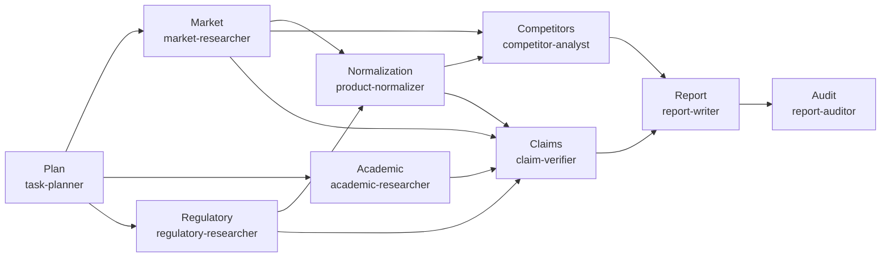

<div align="center">

# 🔬 MedicineMarket-Atlas

**A Local, Agent-Driven Pharmaceutical & Health-Product Market Research System**

[](LICENSE)
[]()
[]()
[]()

</div>

> **MedicineMarket-Atlas** turns a research brief into reproducible, source-grounded market intelligence or evidence-review reports. Nine specialist agents collaborate on planning, research, normalization, analysis, reporting, and auditing — all running locally, with no data leaving your machine.

---

## 📦 Installation

Pick your OS and copy the matching commands. The setup script auto-detects your environment, checks Python/Node.js versions, and installs all dependencies.

### 🍎 macOS / 🐧 Linux

```bash
# 1. Clone the repo
git clone https://github.com/B3122/MedicineMarket-Atlas.git medicinemarket-atlas
cd medicinemarket-atlas

# 2. Run the installer
chmod +x setup.sh
./setup.sh

# 3. Launch Pi
pi
```

### 🪟 Windows

Windows users need **Git Bash** or **WSL (recommended)**, because the `competitor-analyst` agent relies on bash tools.

#### Option A: WSL2 (Recommended)

1. Open PowerShell as administrator and install WSL:

   ```powershell
   wsl --install
   ```

2. Restart your computer and open the Ubuntu terminal.
3. Inside WSL, run:

   ```bash
   git clone https://github.com/B3122/MedicineMarket-Atlas.git medicinemarket-atlas
   cd medicinemarket-atlas
   chmod +x setup.sh
   ./setup.sh
   pi
   ```

#### Option B: Git Bash

1. Install [Git for Windows](https://git-scm.com/download/win).
2. Right-click the project folder in File Explorer → **Git Bash Here**.
3. Run:

   ```bash
   git clone https://github.com/B3122/MedicineMarket-Atlas.git medicinemarket-atlas
   cd medicinemarket-atlas
   chmod +x setup.sh
   ./setup.sh
   pi
   ```

#### Option C: Native CMD

If you only need to inspect the project structure or run scripts that do not depend on bash, you can double-click:

```batch
setup.bat
```

> ⚠️ `setup.bat` does not install the Pi CLI. Full functionality still requires Pi/OpenCode.

---

## 🚀 Quick Start

After installation, run your first research chain in 3 steps:

```bash
# 1. Enter the project
cd medicinemarket-atlas

# 2. Launch Pi
pi

# 3. Run the full market-review chain
/run-chain full-market-review -- projects/coq10-2026/brief.md
```

The system will execute: planning → parallel research (market / academic / regulatory) → product normalization → competitor analysis + claim verification → report writing → independent audit.

Artifacts are saved under `projects/coq10-2026/chain-outputs/`.

---

## ✨ Features

### Three Research Workflows

| Workflow | Chain | Purpose | Output |
|----------|-------|---------|--------|
| **Full Market Review** | `full-market-review` | End-to-end: market, academic, regulatory, competitor, report, audit | Full report + competitor matrix + audit |
| **Quick Competitor Review** | `quick-competitor-review` | Focused competitor comparison without full evidence review | Competitor report + audit |
| **Evidence-Only** | `evidence-only` | Clinical, pharmacological, safety, or claim evidence review | Evidence review report + audit |

### Nine Specialist Agents

| Agent | Role |
|-------|------|
| `task-planner` | Converts a brief into a structured research plan |
| `market-researcher` | Collects market data from e-commerce platforms and brand sites |
| `academic-researcher` | Retrieves and appraises academic evidence (PubMed, trials) |
| `regulatory-researcher` | Retrieves official regulatory, guideline, and labeling info |
| `product-normalizer` | Deduplicates and normalizes product identities (SKU, dose, version) |
| `competitor-analyst` | Builds normalized competitor comparisons with price calculations |
| `claim-verifier` | Cross-checks commercial claims against academic and regulatory evidence |
| `report-writer` | Generates source-grounded reports from validated artifacts |
| `report-auditor` | Independent audit: evidence attribution, data accuracy, logical consistency |

### Three Domain Skill Packs

- **product-market-research** — Most complete: SOP, 9 Python scripts, 6 JSON Schemas (Draft-07), QA fixtures
- **evidence-appraisal** — SOP ready (462 lines); supporting refs/scripts to be built
- **report-generation** — SOP ready (405 lines); supporting refs/scripts to be built

### Data Toolchain

All Python scripts live under `.pi/skills/product-market-research/scripts/`:

| Script | Purpose | Exit Codes |
|--------|---------|------------|
| `validate-listings.py` | Validate product listing data integrity | 0=pass, 1=validation err, 2=file err, 3=parse err |
| `normalize-units.py` | Normalize dosage units (mg, g, IU, etc.) | same |
| `normalize-prices.py` | Normalize price units (CNY, USD, etc.) | same |
| `build-competitor-matrix.py` | Generate competitor comparison matrix | same |
| `calculate-daily-cost.py` | Calculate daily cost from declared dosage | same |
| `validate-source-inventory.py` | Validate source inventory completeness | same |
| `detect-duplicate-products.py` | Detect duplicate or similar products | same |
| `merge-platform-records.py` | Merge cross-platform product records | same |

---

## 🏗️ Architecture

```
┌─────────────────────────────────────────────────────────┐
│                        User                               │
│              brief.md + config.json                       │
└─────────────────────┬───────────────────────────────────┘
                      │
                      ▼
┌─────────────────────────────────────────────────────────┐
│              Pi Orchestrator (main agent)                 │
│  AGENTS.md · SYSTEM.md · .pi/settings.json               │
│  Planning / Delegation / Verification / Assembly / Audit  │
└───┬──────────┬──────────┬──────────┬──────────┬──────────┘
    │          │          │          │          │
    ▼          ▼          ▼          ▼          ▼
┌────────┐┌────────┐┌────────┐┌────────┐┌────────┐
│ market ││academic││regula- ││product ││report  │
│resear- ││resear- ││tory    ││normali-││writer  │
│cher    ││cher    ││resear- ││zer     ││        │
│        ││        ││cher    ││        ││        │
└────────┘└────────┘└────────┘└────────┘└────────┘
┌────────┐┌────────┐┌────────┐┌────────┐
│competi-││claim   ││report  ││  task   │
│tor     ││verifier││auditor ││planner  │
│analyst ││        ││        ││         │
└────────┘└────────┘└────────┘└────────┘
       9 agents, max 3 concurrent, nesting depth ≤ 1

┌─────────────────────────────────────────────────────────┐
│              chain-outputs/                                │
│  01-plan.json → 02-market.json → ... → 09-audit.json      │
└─────────────────────────────────────────────────────────┘
```

**Full market review workflow**:



---

## 📖 Usage Guide

### Create a New Project

```bash
mkdir -p projects/my-project
cp projects/coq10-2026/brief.md projects/my-project/
cp projects/coq10-2026/config.json projects/my-project/
```

Edit `brief.md` and `config.json` to replace the placeholders.

### Run a Single Agent

```
/run market-researcher "Search JD.com and Tmall for CoQ10 supplements"
/run academic-researcher "Find RCTs on CoQ10 for cardiovascular health"
/run claim-verifier "Verify product A's 'supports heart health' claim"
```

### Resume from Checkpoint

Re-run the original chain command. The orchestrator will call `check-progress.py` before execution to detect completed steps and prompt you to resume, restart, or quit.

Artifact validity is the ground truth for completion; `progress.json` does not override missing or invalid artifacts.

### Check Progress

```bash
python .pi/scripts/check-progress.py projects/<project-name>/ --chain full-market-review
```

---

## 📁 Project Structure

```
medicinemarket-atlas/
├── AGENTS.md                     # Orchestrator role and workflow rules
├── SYSTEM.md                     # Full operational specification
├── README.md                     # Bilingual overview
├── README.en.md                  # This file
├── LICENSE                       # MIT License
├── .gitignore                    # Git ignore rules
│
├── .pi/                          # Pi runtime configuration
│   ├── settings.json             # Agent overrides, packages, parallelism
│   ├── agents/                   # 9 specialist agent definitions
│   ├── chains/                   # 3 research workflow templates
│   └── skills/                   # 3 domain skill packs
│
├── projects/                     # Research project directory
│   └── coq10-2026/               # Example project template (placeholder data)
│
├── schemas/                      # Project-level JSON Schemas
└── scripts/                      # Project-level scripts
```

---

## 🛡️ Evidence Discipline

- Never treat commercial claims as scientific evidence
- Never invent prices, sales figures, doses, citations, URLs, or dates
- Every market fact retains source platform, URL, and collection date
- Every academic conclusion retains DOI, PMID, or official source identifier
- Six evidence support levels: directly supported, partially supported, indirectly supported, unsupported, contradicted, cannot determine
- Preserve conflicting data rather than silently selecting one value
- Separate product versions, doses, package sizes, and regional versions

---

## 🤝 Contributing

Issues and PRs are welcome. See [CONTRIBUTING.md](CONTRIBUTING.md) and [CODE_OF_CONDUCT.md](CODE_OF_CONDUCT.md).

---

## 📄 License

[MIT License](LICENSE) · Copyright (c) 2026
