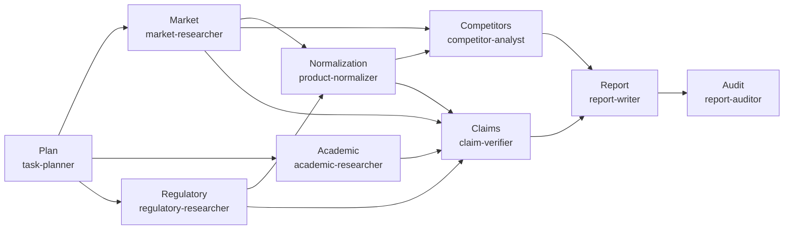

<div align="center">

# 🔬 MedicineMarket-Atlas

**本地化 AI Agent 驱动的医药及保健品市场调研系统**  
**A Local, Agent-Driven Pharmaceutical & Health-Product Market Research System**

[](LICENSE)
[]()
[]()
[]()

</div>

> **MedicineMarket-Atlas** 将一份调研需求书（research brief）转化为可复现、有源可查的市场情报或证据审查报告。系统通过 9 个专项 Agent 协作完成计划、调研、归一、分析、报告与审计，全程本地化运行，数据不留痕。
>
> **MedicineMarket-Atlas** turns a research brief into reproducible, source-grounded market intelligence or evidence-review reports. Nine specialist agents collaborate on planning, research, normalization, analysis, reporting, and auditing — all running locally.

---

## 📦 安装 · Installation

选择你的操作系统，复制对应命令即可开始。安装脚本会自动检测环境、检查 Python 与 Node.js 版本，并安装所有依赖。

Choose your OS and copy the matching commands. The setup script auto-detects your environment, checks Python/Node.js versions, and installs all dependencies.

### 🍎 macOS / 🐧 Linux

```bash
# 1. 克隆仓库 / Clone the repo
git clone https://github.com/B3122/MedicineMarket-Atlas.git medicinemarket-atlas
cd medicinemarket-atlas

# 2. 运行安装脚本 / Run the installer
chmod +x setup.sh
./setup.sh

# 3. 启动 Pi / Launch Pi
pi
```

### 🪟 Windows

Windows 用户需要 **Git Bash** 或 **WSL（推荐）** 环境，因为 `competitor-analyst` Agent 依赖 bash 工具。

Windows users need **Git Bash** or **WSL (recommended)**, because the `competitor-analyst` agent relies on bash tools.

#### 方案 A：WSL2（推荐 / Recommended）

1. 以管理员身份打开 PowerShell，安装 WSL：

   ```powershell
   wsl --install
   ```

2. 重启电脑，进入 Ubuntu 终端。
3. 在 WSL 中运行：

   ```bash
   git clone https://github.com/B3122/MedicineMarket-Atlas.git medicinemarket-atlas
   cd medicinemarket-atlas
   chmod +x setup.sh
   ./setup.sh
   pi
   ```

#### 方案 B：Git Bash

1. 安装 [Git for Windows](https://git-scm.com/download/win)。
2. 在资源管理器中右键项目文件夹 → **Git Bash Here**。
3. 运行：

   ```bash
   git clone https://github.com/B3122/MedicineMarket-Atlas.git medicinemarket-atlas
   cd medicinemarket-atlas
   chmod +x setup.sh
   ./setup.sh
   pi
   ```

#### 方案 C：原生 CMD / Native CMD

如果只需要查看项目结构或运行不依赖 bash 的脚本，可直接双击：

```batch
setup.bat
```

> ⚠️ `setup.bat` 不会安装 Pi CLI。完整功能仍需 Pi/OpenCode 环境。
> ⚠️ `setup.bat` does not install the Pi CLI. Full functionality still requires Pi/OpenCode.

---

## 🚀 快速开始 · Quick Start

安装完成后，3 步即可运行第一条调研链：

After installation, run your first research chain in 3 steps:

```bash
# 1. 进入项目 / Enter project
cd medicinemarket-atlas

# 2. 启动 Pi / Launch Pi
pi

# 3. 运行完整市场审查链 / Run the full market-review chain
/run-chain full-market-review -- projects/coq10-2026/brief.md
```

系统将自动执行：计划 → 三路并行调研（市场 / 学术 / 监管） → 产品归一化 → 竞品分析 + 声明验证 → 报告撰写 → 独立审计。

The system will execute: planning → parallel research (market / academic / regulatory) → product normalization → competitor analysis + claim verification → report writing → independent audit.

产物保存于 `projects/coq10-2026/chain-outputs/`。

Artifacts are saved under `projects/coq10-2026/chain-outputs/`.

---

## ✨ 核心能力 · Features

### 三大调研工作流 · Three Research Workflows

| 工作流 Workflow | 链 Chain | 用途 Purpose | 产出 Output |
|---|---|---|---|
| **完整市场审查** Full Market Review | `full-market-review` | 全流程：市场、学术、监管、竞品、报告、审计 | 完整报告 + 竞品矩阵 + 审计报告 |
| **快速竞品审查** Quick Competitor Review | `quick-competitor-review` | 聚焦竞品对比，无需完整证据审查 | 竞品对比报告 + 审计报告 |
| **纯证据审查** Evidence-Only | `evidence-only` | 临床/药理/安全性/声明的证据审查 | 证据审查报告 + 审计报告 |

### 九大专项 Agent · Nine Specialist Agents

| Agent | 职责 Role |
|---|---|
| `task-planner` | 解析 brief，生成结构化调研计划 |
| `market-researcher` | 电商平台与品牌官网市场数据采集 |
| `academic-researcher` | PubMed、临床试验等学术证据检索与评估 |
| `regulatory-researcher` | 官方监管机构、指南、标签信息检索 |
| `product-normalizer` | 产品身份去重：SKU、规格、剂型、版本归一 |
| `competitor-analyst` | 归一化竞品对比，价格计算，定位分析 |
| `claim-verifier` | 商业声明 vs 学术/监管证据交叉验证 |
| `report-writer` | 从已验证产物生成有源报告 |
| `report-auditor` | 独立审计：证据归属、数据准确性、逻辑一致性 |

### 三大领域技能包 · Three Domain Skill Packs

- **product-market-research** — 产品市场调研（最完整：含 SOP、9 个 Python 脚本、6 个 JSON Schema、QA 测试数据）
- **evidence-appraisal** — 证据评估（SOP 已就绪，refs/scripts 待建设）
- **report-generation** — 报告生成（SOP 已就绪，refs/scripts 待建设）

### 数据工具链 · Data Toolchain

所有 Python 脚本位于 `.pi/skills/product-market-research/scripts/`：

| 脚本 Script | 功能 Purpose | 退出码 Exit Codes |
|---|---|---|
| `validate-listings.py` | 验证商品列表数据完整性 | 0=通过, 1=校验错误, 2=文件错误, 3=解析错误 |
| `normalize-units.py` | 统一规格单位（mg/g/IU 等） | 同上 |
| `normalize-prices.py` | 统一价格单位（CNY/USD 等） | 同上 |
| `build-competitor-matrix.py` | 生成竞品对比矩阵 (JSONL → CSV/XLSX) | 同上 |
| `calculate-daily-cost.py` | 按日用量计算日均费用 | 同上 |
| `validate-source-inventory.py` | 验证来源清单完整性 | 同上 |
| `detect-duplicate-products.py` | 检测重复/相似商品 | 同上 |
| `merge-platform-records.py` | 合并跨平台商品记录 | 同上 |

---

## 🏗️ 系统架构 · Architecture

```
┌─────────────────────────────────────────────────────────┐
│                      用户 · User                          │
│              brief.md + config.json                       │
└─────────────────────┬───────────────────────────────────┘
                      │
                      ▼
┌─────────────────────────────────────────────────────────┐
│              Pi Orchestrator (主控 Agent)                  │
│  AGENTS.md · SYSTEM.md · .pi/settings.json               │
│  任务规划 / 委托 / 验证 / 聚合 / 审计                         │
└───┬──────────┬──────────┬──────────┬──────────┬──────────┘
    │          │          │          │          │
    ▼          ▼          ▼          ▼          ▼
┌────────┐┌────────┐┌────────┐┌────────┐┌────────┐
│ market ││academic││regula- ││product ││report  │
│resear- ││resear- ││tory    ││normali-││writer  │
│cher    ││cher    ││resear- ││zer     ││        │
│        ││        ││cher    ││        ││        │
└────────┘└────────┘└────────┘└────────┘└────────┘
┌────────┐┌────────┐┌────────┐┌────────┐
│competi-││claim   ││report  ││  task   │
│tor     ││verifier││auditor ││planner  │
│analyst ││        ││        ││         │
└────────┘└────────┘└────────┘└────────┘
         9 个专项 Agent，最大并行 3 个，嵌套深度 ≤ 1
```

**完整市场审查工作流示意**：



---

## 📖 使用指南 · Usage Guide

### 创建新项目 · Create a New Project

```bash
mkdir -p projects/my-project
cp projects/coq10-2026/brief.md projects/my-project/
cp projects/coq10-2026/config.json projects/my-project/
```

编辑 `brief.md` 和 `config.json` 替换占位符。

Edit `brief.md` and `config.json` to replace the placeholders.

### 运行单个 Agent · Run a Single Agent

```
/run market-researcher "搜索京东和天猫上的 CoQ10 保健品"
/run academic-researcher "检索 CoQ10 对心血管健康的 RCT 文献"
/run claim-verifier "验证产品 A 的'支持心脏健康'声明"
```

### 断点续跑 · Resume from Checkpoint

重新执行原始链命令即可。主控 Agent 会在运行前调用 `check-progress.py` 检测已完成步骤，并提示继续 / 重启 / 退出。

Re-run the original chain command. The orchestrator will call `check-progress.py` before execution to detect completed steps and prompt you to resume, restart, or quit.

产物文件的有效性是判断完成与否的唯一依据；`progress.json` 不会覆盖缺失或无效的产物。
Artifact validity is the ground truth for completion; `progress.json` does not override missing or invalid artifacts.

### 查看进度 · Check Progress

```bash
python .pi/scripts/check-progress.py projects/<project-name>/ --chain full-market-review
```

---

## 📁 项目结构 · Project Structure

```
medicinemarket-atlas/
├── AGENTS.md                     # 主控 Agent 角色与工作流规范
├── SYSTEM.md                     # 完整操作规范
├── README.md                     # 本文件
├── README.en.md                  # English version
├── LICENSE                       # MIT License
├── .gitignore                    # Git 忽略规则
│
├── .pi/                          # Pi 运行时配置
│   ├── settings.json             # Agent 覆写、包依赖、并行策略
│   ├── agents/                   # 9 个专项 Agent 定义
│   ├── chains/                   # 3 个调研工作流模板
│   └── skills/                   # 3 个领域技能包
│
├── projects/                     # 调研项目目录
│   └── coq10-2026/               # 示例项目模板（占位符数据）
│
├── schemas/                      # 项目级 JSON Schema
└── scripts/                      # 项目级脚本
```

---

## 🛡️ 证据纪律 · Evidence Discipline

- 永不以商业声明冒充科学证据
- 永不编造价格、销量、剂量、引用、URL、日期
- 每条市场数据保留来源平台、URL、采集日期
- 每条学术结论保留 DOI、PMID 或官方来源标识
- 区分直接、部分、间接、无证据、矛盾、无法判断六种支持等级
- 保留冲突数据而非静默选择其一
- 区分产品版本、剂量、包装规格、区域版本

---

## 🤝 参与贡献 · Contributing

欢迎提交 Issue 与 PR。详见 [CONTRIBUTING.md](CONTRIBUTING.md) 与 [CODE_OF_CONDUCT.md](CODE_OF_CONDUCT.md)。

Issues and PRs are welcome. See [CONTRIBUTING.md](CONTRIBUTING.md) and [CODE_OF_CONDUCT.md](CODE_OF_CONDUCT.md).

---

## 📄 许可证 · License

[MIT License](LICENSE) · Copyright (c) 2026
